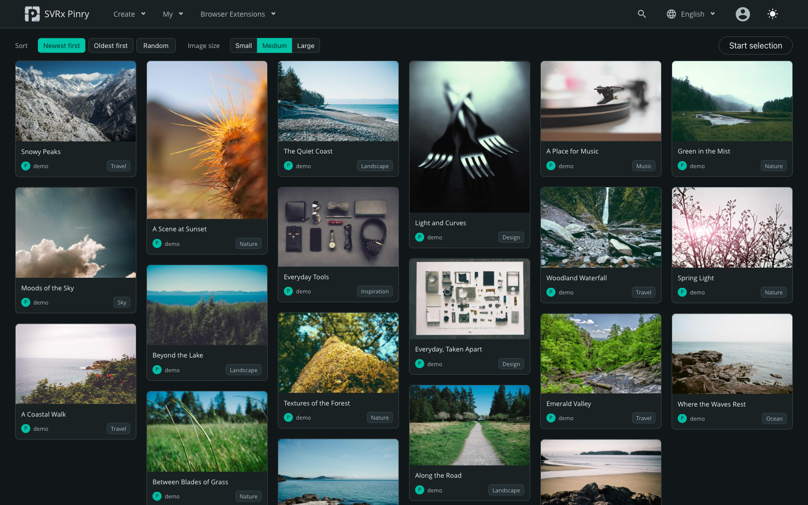

<p align="center">
  
</p>

<h1 align="center">SVRx Pinry Server</h1>

**English** | [한국어](README.ko.md)

[](https://chromewebstore.google.com/detail/svrx-pinry/kgncmldoobdakadnojepmalpbmacoonh?authuser=0&hl=ko)
[](https://microsoftedge.microsoft.com/addons/detail/svrx-pinry/gmbgeiddpdblpjdbceoofclpeiikobjj)

<p align="center">A self-hosted image board for organizing and managing large image collections</p>

SVRx Pinry Server runs on your own server or NAS and organizes images with boards and tags.
The companion browser extension lets you select multiple images from a webpage and save them together.

It is not Synology-only: it can run on servers, PCs, and NAS devices capable of running Docker.
The installation examples use Docker Engine or Docker Desktop with Docker Compose v2.
Check that the published image supports your device's CPU architecture before installing.
The main interface and Django administration support Korean, English, Chinese, and French,
with Korean as the default server language and the SPA language selection shared with administration.

This is an unofficial modified distribution of Pinry.

[Server repository](https://github.com/sruinz/SVRx-Pinry) · [Browser extension](https://github.com/sruinz/SVRx-Pinry-Extention)

The server manages images and accounts; the Chrome/Edge extension collects web images and saves them to your server.



*Dark-mode main screen with demo content. [Photo credits](docs/src/imgs/screenshots/CREDITS.md).*

## Features

### Browsing and viewing

- Responsive pin grid with newest, oldest, and random ordering; small, medium, and large cards with remembered preferences
- Animated GIF/WebP badges and filters for image type, aspect ratio, minimum dimensions, and creation date
- Multi-tag AND search, search filters stored in the URL, and unfiltered searches
- Previous/next navigation, original-size and fit-to-screen viewing, and remembered viewing preferences
- Fullscreen and slideshows with 1, 3, 5, or 10-second intervals; next-image preloading to reduce transition delays
- Light/dark themes, Korean/English/Chinese/French localization, keyboard navigation, and visible focus indicators

### Boards and bulk management

- Organize images with boards and tags; select, range-select, select all, and bulk edit, move, or delete
- Show existing board membership and prevent duplicate additions
- Choose whether deleting a board also deletes its pins; search, inspect usage, and merge duplicate tags in administration
- Export selected pins or owned boards as background ZIP jobs containing originals, XMP sidecars, and a manifest
- Preserve original filenames, prevent duplicate image storage, and separate originals from thumbnails and derived files
- Browser extension support for collecting multiple images and creating pins in batches

### Accounts and operation

- Authentik, Synology, Google, Microsoft, GitHub, and generic OIDC sign-in with provider-specific setup guides
- Link existing accounts by verified email; choose a username and local password when signing up through SSO
- Separate password-login and API-token policies, with administrator recovery login through direct internal-network access
- Unified profile, token, SSO, and administration cards; tokens masked by default with explicit reveal/copy controls
- Profile badges showing the running source revision and backend/frontend dependency versions
- Automatic backup and migration of legacy Pinry data, legacy configuration compatibility, and migration/recovery status pages
- Docker Hub images, local source builds, and upgrades that preserve persistent data

## Modernized runtime

The familiar board, tag, and image-management workflow is retained while the runtime and interface have been updated.
The source currently uses the following principal dependencies. Check the profile for the versions actually running in your image.

| Area | Components |
| --- | --- |
| Backend | Python 3.14, Django 5.2.17 LTS, Django REST Framework 3.16.1 |
| Image processing | Pillow 12.3.0 |
| Frontend | Vue 3.5.42, Vue Router 4.6.4, PrimeVue 4.5.5 |
| Localization | vue-i18n 11.4.10 in non-legacy mode |
| Build tools | Node 24, pnpm 9.15.9, Vite 8.3.0 |

Vite replaces the Vue CLI/Webpack build, and secondary pages load on demand.
Login, profile, grid, and detail screens have been refreshed without replacing the core workflow.
Export-worker idle CPU usage and slideshow image loading have also been improved.
This does not mean every dependency is the newest available or that all security issues have been eliminated.
Maintain appropriate access controls and backups for your installation.

## SSO and internal-network administrator recovery

Only enabled providers appear on the login screen, with locally served provider icons.
If both SSO and password login are allowed, the password form can be expanded.
Password-only mode shows it immediately; SSO-only mode does not show password fields.
The administrator recovery screen uses a matching responsive design.

Starting SSO from an internal IP redirects to the provider's configured public HTTPS service address **before authentication begins**.
Authentication finishes at that public address; it does not return to the internal IP or copy sessions between the IP and domain.
An already authenticated address redirects the login screen to the home page.
Preserve HTTPS enforcement and the original Host when configuring the public reverse proxy.

Password login and API tokens are enabled by default, with no active SSO providers.
An upgrade alone does not disable existing accounts or tokens.
A super administrator can configure multiple providers in Django administration.
Register the exact callback URL shown by the application with the identity provider.
For Microsoft, use a tenant UUID rather than `common`.

### Provider setup

Forms show only relevant fields, with examples. Authentik normally needs Client ID, Client Secret, and Discovery URL;
the issuer and server origin are resolved automatically.
Display name, ordering, manual issuer, and additional allowed origins are in advanced settings.
Ordinary self-hosted IdP connections do not require manually entering CIDRs.

The **SSO setup guide** shows provider registration steps and Discovery URLs.
Save a new provider while disabled to obtain its stable callback URI, register it with the IdP, then enable it.
The current access address shown in the guide is informational.
The registration URI uses the saved public HTTPS service address; the guide does not change settings automatically.

### Existing accounts and new sign-ups

A verified email from the provider can automatically link to one matching existing account.
Matching passwords or linking in advance is unnecessary.
Unverified or duplicate emails and conflicting provider connections are not automatically linked.
Manual linking/unlinking remains available under the profile's advanced controls and requires recent reauthentication.
Authentik HS256 signatures are verified with the corresponding Client Secret, without treating public keys as shared secrets.

If a provider permits new registrations, SSO authentication is followed by **Create Pinry account**.
A username, Pinry password, and password confirmation are required.
The email prefix is suggested as a username but may be edited; usernames must be unique.
An account and login session are not created until the form is completed.
The sign-up authentication is valid for 10 minutes in that browser; starting a new authentication in another tab invalidates the earlier form.
Unverified email is not stored for automatic linking.

Your Pinry password is not sent to the SSO provider.
It must be set at sign-up even if local login is disabled, but cannot be used for login until local login is enabled.
If the administrator later disables SSO and allows password login, use the username and password chosen at sign-up.
Existing linked accounts keep their passwords and do not repeat the sign-up form.
Bulk renaming old generated usernames, a separate nickname system, and announcement delivery are not included.

For manual linking, use the profile at the public service address.
Enter your **Pinry password**, select **Reauthenticate**, and complete the desired provider's account-link flow within five minutes.
When password reauthentication is unavailable, reauthenticate with an already linked SSO account.
Provider sessions may complete this without another password prompt.
Unlinking the last usable login method is blocked to prevent account lockout.

Disabling password login requires a recent successful super-administrator SSO login.
A separate recent recovery-login test is not mandatory.
API token access is controlled independently: disabling it blocks token exposure, issuance, and authentication without deleting existing tokens.
Re-enabling it allows existing integrations to resume.

### Recovery access

Direct access through an internal IP and port can expose **administrator recovery login**.
It requires an active super-administrator password, CSRF validation, rate limiting, and a 15-minute recovery session.
A private IP is not a substitute for administrator authentication.
Reverse proxies must preserve the original Host and forwarding headers, and the direct service port must not be forwarded to the public internet.
The dedicated TLS recovery port is also retained.
Use the administrator screen's **SSO setup guide** to register providers.
The backup and recovery instructions below apply to Docker installations generally.
DSM-specific configuration is documented separately in the
[Synology guide (Korean)](deploy/synology/README_KO.md#sso와-복구-배포).

## Animation badges and continuous viewing

Only GIF/WebP files with at least two frames receive `GIF` or `WEBP` text badges.
The badges do not include a triangular play icon.
Static GIF/WebP images do not; thumbnails are unchanged.
New images are inspected when registered. Older records gain a nullable animation-status field without a full startup scan.
Previously unclassified GIF/WebP originals are inspected on first pin retrieval, which can add file reads for that request.
The saved result is reused afterward; originals, metadata, timestamps, and thumbnails are not modified.

Unreadable or corrupt originals receive no badge, and failed inspection results are stored to avoid repeated scans.
Replacing or repairing a file outside the application does not automatically refresh the saved classification.

Use previous/next controls or the left/right arrow keys to follow the current list's order.
Tag, user, board, and ordering filters are retained, and more results load when needed.
A counter such as `13 / 30+` means additional pages have not yet been loaded.
Navigation stops at the actual end rather than looping.
Closing the detail view with Escape or a background click preserves the grid position.
Mobile uses buttons; swipe navigation is not added because it can conflict with scrolling and zooming.
A standalone pin permalink has no previous/next controls. Loading errors appear inside the detail view.

Click the image or select **Original size (100%)** to display the stored original at its actual size and scroll within the viewer.
Toggle back to fit the screen. **Open stored original** opens the saved file in another tab and is distinct from the external original-image source link.
The viewing preference persists for the same browser and origin across pins, reopening, and refresh.
Only the scroll position resets when switching images.
If browser storage is unavailable, the preference lasts within the current viewer; the initial default is fit-to-screen.

## Grid image sizes

Use **Image size** beside the sorting controls to choose small, medium, or large.
Desktop card widths are 160, 240, and 320 pixels; medium is the standard size.
Column count adapts to the viewport. Narrow mobile screens use one column, while small cards can use two where space allows.

The preference is shared by the main grid, board pins, and search results on the same browser and origin.
It does not change board-list cards or the detail viewer's original-size preference.
Changing size preserves selection and ordering while recalculating layout.
With browser storage blocked, the setting lasts for the current list only.

## Browser extension

[SVRx Pinry Extension](https://github.com/sruinz/SVRx-Pinry-Extention) selects multiple images on a webpage
and saves them with shared boards, tags, and visibility settings.
Configure the server address and API token in the extension's options.

Install from the [Chrome Web Store](https://chromewebstore.google.com/detail/svrx-pinry/kgncmldoobdakadnojepmalpbmacoonh?authuser=0&hl=ko),
[Microsoft Edge Add-ons](https://microsoftedge.microsoft.com/addons/detail/svrx-pinry/gmbgeiddpdblpjdbceoofclpeiikobjj),
or manually from the extension repository.
Chrome and Edge are officially supported; Firefox is not.
The original Pinry Chrome/Firefox extensions are legacy single-pin clients.

To package the SVRx extension, run this from the **extension repository**, not the server repository:

```sh
bash scripts/package.sh
```

Its ZIP is generated under the shared workspace `output/` directory as
`svrx-pinry-extension-<12-character-commit>/svrx-pinry-extension-0.1.0.zip`.

## Install from Docker Hub

Use [docker-compose.hub.yml](docker-compose.hub.yml) with the maintainer's
[`sruinz/svrx-pinry:latest` image](https://hub.docker.com/r/sruinz/svrx-pinry).
No local image build is required.

Download the repository and run the commands from its directory. Skip cloning if you already have the source.

```sh
git clone https://github.com/sruinz/SVRx-Pinry.git
cd SVRx-Pinry
```

```sh
docker compose -f docker-compose.hub.yml pull
docker compose -f docker-compose.hub.yml up -d
```

Open `http://SERVER_ADDRESS:2048`. Data is stored in `./data` relative to the Compose file,
mounted read-write at `/data`. The `unless-stopped` policy restarts the container automatically
unless you explicitly stopped it. Compose creates its default network; host networking is not required.
Keep the automatic-migration startup command in the example.

**Existing installations:** stop the old container and back up the entire data directory first.
Keep its existing host-side volume path, or copy the complete data into the new `./data` directory
while the old container is stopped. Pointing at an empty directory starts an empty installation.
Do not run two containers against the same data directory.
For legacy service-worker transitions, follow the procedure below before replacing the service.

To update this installation after backing up:

```sh
docker compose -f docker-compose.hub.yml pull
docker compose -f docker-compose.hub.yml up -d --force-recreate
```

The published image may not match the latest source commit. Check the running version in the profile.

## Build an image yourself

From the repository root, use the production `Dockerfile.autobuild` in an environment with Docker.
The image build prepares both the frontend and backend.

```sh
docker build --pull -f Dockerfile.autobuild \
  --build-arg PINRY_SOURCE_COMMIT="$(git rev-parse HEAD)" \
  -t svrx-pinry:latest .
```

Change `image` in [docker-compose.hub.yml](docker-compose.hub.yml) to the locally built
`svrx-pinry:latest`, then start it. Keep the port, `./data:/data:rw` mount,
automatic-migration command, and restart policy. For local builds, run the build command
instead of the Docker Hub `pull` step. The root `docker-compose.example.yml` is a separate
development example, not this production installation workflow.

### Building on Synology (optional)

For a DSM Container Manager build package, run `./scripts/create_synology_output.sh`
in a development environment with Git, Python 3, and Bash.
The default output is `output/svrx-pinry-server-<12-character-commit>/` next to the repository.
It includes the main `svrx-pinry/` build package, the `sw-transition/` browser-cache transition
tool, and optional `accept-tools/` for validating copied data. The server archive contains
only `svrx-pinry/`. Databases, uploaded media, and secrets are not included.

The generated Compose uses Synology-specific host paths; do not confuse it with the general
Docker example. DSM screens and paths are documented separately in the
[Synology installation and build guide (Korean)](deploy/synology/README_KO.md).
This package is not required for a general Docker installation.

### Existing service workers

This applies only when a legacy Pinry service worker remains at the same origin.
Prepare the package generator's `sw-transition/` directory on the Docker host.
Stop the old container, then start the temporary transition service without a data mount:

```sh
docker compose -f sw-transition/docker-compose.yml up -d --build
```

Match the ports and reverse proxy so the transition service uses the **same origin** as before.
Its default port is 2048; it cannot share that port with the old service at the same time.
Visit the transition page with every previously used browser/extension client and confirm
**Transition ready**, then stop the temporary service:

```sh
docker compose -f sw-transition/docker-compose.yml down
```

Start the main service with the existing data path mounted.
This browser-cache transition does not replace data migration.

## First administrator account

On a new installation, the first successful web registration automatically becomes an active Django staff user and superuser.
The intended operator should register before other users.

During an upgrade, an existing active superuser keeps their permissions.
If none exists, the earliest active account ordered by `(date_joined, id)` is promoted once.
If there are no active accounts, the next successful web registration becomes administrator.
This bootstrap completes only once: intentionally demoting an administrator does not repeatedly promote other users.

An active staff user can open **Administrator settings** in their own profile to access `/admin/`.
Manage subsequent user permissions in Django administration.

## Administrator tag management

In **Administrator settings → Taggit → Tags**, search tags and inspect their pin counts.
Individual tags can be renamed or deleted.

To combine duplicates, select at least two tags, choose the merge action, and select the surviving tag.
Pin associations move to the surviving tag, duplicate associations are collapsed, and other selected tags are deleted.
This runs in one transaction and requires both tag-change and tag-delete permissions.
Back up the data folder before large merges.

## Multi-tag search

Select one or more tags in search. Results must contain **all** selected tags.
For example, selecting `travel` and `night` returns pins tagged with both.

Existing single-tag links and `/pins/tags/<tag>` routes remain available.
API clients can repeat `tags__name` for the same AND behavior:

```text
/api/v2/pins/?tags__name=travel&tags__name=night
```

## Board membership

The add-to-board screen shows membership in boards owned by the current user.
A pin already added to one of your boards is marked as already included, even if another user created it, and cannot be selected again.

Membership is fetched only for the add-to-board detail screen.
Other users' board information is not exposed on the main pin cards.
If membership cannot be loaded, adding is disabled rather than risking duplicates.

## Exporting original pins and boards

Logged-in users can preview and export selected pins or owned boards, then inspect progress and download completed files under **My menu → Exports**.
Jobs continue after the browser closes. After a normal container stop/restart, processing resumes from the last confirmed snapshot and attempt state.
Partial ZIP files are never published as completed downloads.

Confirming an export freezes its target pin list; pins added to a board afterward are not included.
Descriptions, tags, and original files are fixed when the background worker creates a safe snapshot.
Items already copied remain exportable from that snapshot even if the source pin is later deleted.
If an owned original disappears or changes before a consistent snapshot can be completed, the job fails instead of returning a partial result.

Completed ZIPs are downloadable for **up to 24 hours after completion**.
This is a retention period, not a daily export limit.
You can start another export when no job is in progress.
A new successful export immediately replaces the previous successful ZIP; a failed new export leaves the previous ZIP available until its original expiry.
Expired archives and old job files are cleaned according to the retention policy.

Each pin has an original image and an XMP sidecar, with metadata also stored in `manifest.json`.
Original bytes and embedded EXIF/IPTC/XMP are not rewritten.
Pin creation time (`Pin.published`), descriptions, and tags are preserved in XMP and the manifest.
ZIP entry timestamps use the pin's creation time within ZIP format limits; XMP and the manifest retain the exact UTC value.

The ZIP's `originals/` is a flat directory.
Original filenames are retained where possible and normalized for operating-system compatibility.
Case-insensitive collisions receive a short identifier before the extension to prevent overwriting.
Pins sharing an original still receive separate image/XMP pairs; consult the manifest for exact mappings.

Permission checks during snapshotting and immediately before publication exclude other users' deleted or newly private pins.
Missing or changed originals belonging to the requester fail the complete job rather than silently creating an incomplete export.
Each account can have one active request, and ZIP generation is processed sequentially.
**Waiting for worker** can mean worker startup or another job ahead in the queue, not necessarily a service failure.
For storage, space, or expiry errors, follow the retry guidance and inspect container error codes with
`docker logs --tail 200 svrx-pinry`.

Exports need space for snapshots and safe publication in addition to the estimated ZIP size.
Do not manually delete or change ownership/permissions of `/data/exports`, `.staging`, or `ready`.
Include export data in operational backups.
Databases, media, export ZIPs, accounts, and secrets are excluded from deployment packages and Docker build contexts.

## File storage layout

Instead of legacy Pinry's hash-based paths (`<first character>/<second character>/<MD5>/<filename>`),
each image has a UUID, with **originals and derived images stored separately**.
Early SVRx Pinry used `originals/<UUID>/original.<extension>`;
the current layout also uses the original filename where possible.

The default media root is `/data/static/media/` inside the container, mapped to
`./data/static/media/` on the host by the Docker Hub Compose example.
For one JPEG image, the layout looks like this:

```text
data/static/media/
├── originals/
│   └── <image UUID>/
│       └── photo.jpg
└── derivatives/
    └── <same image UUID>/
        ├── thumbnail.jpg
        ├── standard.jpg
        └── square.jpg
```

- `originals/`: uploaded original images, not re-encoded to change their storage paths.
- `derivatives/`: size-specific images used in grids and previews.
- Unsupported filename characters are replaced safely and long names are shortened.
  If no usable name remains, `image-<short identifier>` is used.
  Extensions follow the actual image format and may differ from the supplied filename.
- Different images with the same filename are separated by UUID directories.
  A matching name alone does not overwrite an existing file.

To let another photo-management tool read only originals, expose `originals/` read-only,
avoiding thumbnail imports. This is not two-way synchronization.
Do not move, rename, or delete files through external tools: doing so can break database references.

The automatic migration below updates existing files together with their database references;
users do not need to rearrange files manually.
Originals alone cannot restore accounts, boards, and tags: back up the **entire data directory**.
Export ZIPs intentionally omit UUID subdirectories for convenience and differ from server storage.

## Automatic migration of existing Pinry data

The supplied Compose's `--migrate-legacy` startup command detects existing data.
New empty data folders and installations already using the current format start normally.
Legacy Pinry data or SVRx Pinry data requiring changes are migrated without separate manual transfer commands.
Schema updates explicitly known to be unrelated to media use standard Django migrations without rescanning every original.
The current fast-path allowlist is:

- `django_images.0007_startup_validation_state`
- `users.0002_admin_bootstrap`
- `exports.0001_initial`
- `exports.0002_exporttarget_identity_snapshot`

Unknown or media-related changes retain the full safety procedure:

1. Create an online SQLite snapshot and verify integrity.
2. Move legacy media into the UUID/original-filename storage layout.
3. Record confirmed batches so a normal restart can resume.
4. After final validation, preserve legacy files under `data/legacy-backup/<run-id>/` and start the service.

Before migration, stop the old container and back up the **entire data folder** separately.
Continue mounting the original data path, or copy its full contents into the new `data` folder.
Avoid nesting it as `data/data`.
Do not remove the generated Compose automatic-migration `command`.

A Korean progress page is served at the same address while normal API and media access are blocked.
Closing the browser does not stop migration.
Do not force-stop the container/project or alter the data folder during processing.
A normal stop/restart resumes from the last confirmed batch; successful completion switches to the normal service.

Duration depends on server hardware, storage, image counts, and image sizes.
Allow enough free disk space to retain both the data and migration backups.

View progress at `/migration/` or `/migration-status.json`.
Errors are classified as retryable, requiring user action, or fatal.
The service does not start with incomplete data; originals and backups are preserved.
Check the displayed error code alongside `docker logs --tail 200 svrx-pinry`.
Follow the backup and rollback precautions below.

## Checking the running version

`BUILD_INFO`, image labels, and the running server identify the source commit used to build an image.
After logging in, check **My menu → Profile → Build information**, or use the version API with the required authenticated session:

```sh
curl -s http://SERVER_ADDRESS:2048/api/v2/version/
```

If you rebuilt an image with the same `latest` tag, recreate the container to run the new image:

```sh
docker compose -f docker-compose.hub.yml up -d --force-recreate
```

## Persistent data

The default example mounts the host's `./data` at `/data` in the container.
An absolute host path is also possible, but keep mounting the same data directory across upgrades.
Preserve the whole directory, including the default SQLite installation's `production.db`,
`local_settings.py`, images, and exports. If you configure an external database or separate storage,
back up those resources separately too.

For a file-level backup, stop the container normally, copy the entire data directory to a separate
location, then restart it. Avoid copying only a live SQLite database file.
Automatically generated migration backups do not replace a separate complete backup.
Do not delete the data directory or substitute an empty one when replacing containers or images.

## Upgrades and recovery

Before replacing an image, back up the data folder and record the current image tag and digest.
Apply the new image using the Docker Hub update commands or local build procedure above.
The repository's `main` revision and the running container's revision may differ; check profile build information to confirm what is deployed.

When startup fails, the recovery page preserves originals and backups and shows error codes and retry eligibility.
**Restart server** retries Pinry startup; it does not reboot the host.
If application readiness times out after 60 seconds following migration, startup retries automatically
after a 30-second wait once safety checks pass. No browser needs to remain open. Automatic and manual
retries share a limit of three accepted retries per supervisor run; a manual retry cancels the pending
automatic attempt. Cleanup rechecks children that exit late. The page explains blocked recovery,
including pending process exit and failed state or lock verification. If the limit is exhausted or
verification keeps failing, inspect the logs and restart the container using your container manager;
rebooting the host is not required.
Not every failure is recoverable automatically. Follow the logs and setup guide when configuration or data checks are required.

To roll back, stop the container first and preserve the failed state separately.
Use the complete pre-upgrade backup together with its corresponding previous image;
do not attach only an old image to the migrated database.
Check paths, permissions, and free space before starting again.

## License and attribution

SVRx Pinry is distributed under the BSD 2-Clause license.

- [License](LICENSE.md)
- [Open-source notices](NOTICE.md)
- [Upstream information](UPSTREAM.md)

Third-party copyright and license notices are preserved, including those for the locally served provider icons.

## Support

If SVRx Pinry is useful to you, you can support its development:

- [GitHub Sponsors](https://github.com/sponsors/sruinz)
- [Buy Me a Coffee](https://www.buymeacoffee.com/sruinz)
